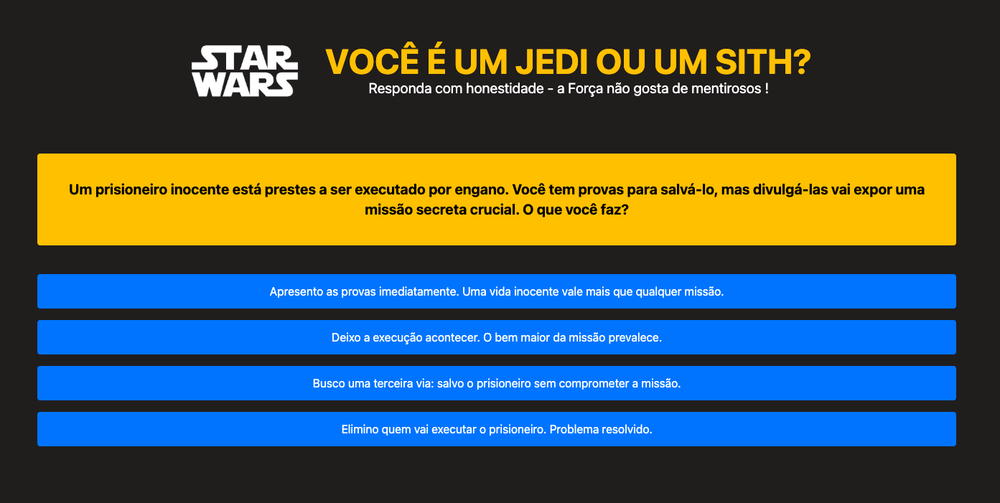

# Jedi ou Sith? — O Quiz que a Força Escolheu por Você

<p style='text-align:center; font-weight:bold'>"Luminous beings are we, not this crude matter."* — Mestre Yoda</p>




s

## 📖 Descrição

Um quiz interativo temático do universo **Star Wars** onde o usuário descobre se pertence ao **lado da Luz** ou ao **lado Sombrio** da Força. Com 5 perguntas de dilemas morais profundos — inspirados na filosofia da saga — cada resposta revela um pouco mais sobre quem você realmente é. No final, a Força dá seu veredicto: **Jedi** 🔵 ou **Sith** 🔴?

---

## ❓ Perguntas do Quiz

### Pergunta 1 — O Dilema do Inocente

> *Um prisioneiro inocente está prestes a ser executado por engano. Você tem provas para salvá-lo, mas divulgá-las vai expor uma missão secreta crucial. O que você faz?*

| # | Resposta | Lado |
|---|----------|------|
| A | Apresento as provas imediatamente. Uma vida inocente vale mais que qualquer missão. | 🔵 Jedi |
| B | Busco uma terceira via: salvo o prisioneiro sem comprometer a missão. | 🔵 Jedi |
| C | Deixo a execução acontecer. O bem maior da missão prevalece. | 🔴 Sith |
| D | Elimino quem vai executar o prisioneiro. Problema resolvido. | 🔴 Sith |

---

### Pergunta 2 — A Traição do Mestre

> *Você descobre que seu mestre/mentor escondeu uma verdade dolorosa de você por anos "para o seu bem". Como você reage?*

| # | Resposta | Lado |
|---|----------|------|
| A | Fico triste, mas entendo que ele agiu por amor. Perdoo e sigo em frente. | 🔵 Jedi |
| B | Confronto com serenidade. Exijo honestidade, mas mantenho o respeito. | 🔵 Jedi |
| C | Sinto raiva intensa. Isso é uma traição — ninguém mais merece minha confiança. | 🔴 Sith |
| D | Destruo a reputação dele. Se ele me enganou, merece pagar. | 🔴 Sith |

---

## 🗂️ Estrutura do JSON

O quiz utiliza um arquivo `.json` com o seguinte formato:

```json
{
  "title": "Você é um Jedi ou um Sith?",
  "questions": [
    {
      "id": 1,
      "question": "Texto da pergunta...",
      "options": [
        { "id": 1, "name": "Texto da resposta", "alias": "Jedi" },
        { "id": 2, "name": "Texto da resposta", "alias": "Sith" }
      ]
    }
  ],
  "results": {
    "Jedi": "Mensagem de resultado Jedi...",
    "Sith": "Mensagem de resultado Sith..."
  }
}
```

O campo `alias` de cada opção assume os valores `"Jedi"` ou `"Sith"`, que correspondem diretamente às chaves do objeto `results`. A lógica de apuração consiste em contar qual alias acumulou mais respostas ao longo das 5 perguntas.

---

## 🚀 Como usar no Angular

1. Adicione o arquivo `quiz-jedi-ou-sith.json` em `src/assets/`
2. Carregue via `HttpClient`:

```typescript
this.http.get<Quiz>('assets/quiz-jedi-ou-sith.json').subscribe(data => {
  this.quiz = data;
});
```

3. Ao final, some as respostas por `alias` e exiba `results[aliasVencedor]`.

---

<p style='text-align:center; font-size:30px; font-weight:bold'> May the Force be with you.* 🌌</p>

